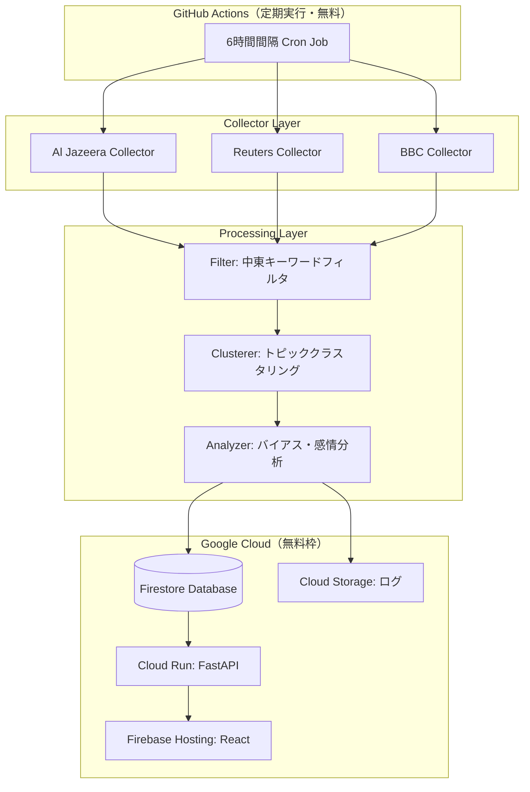

# 設計書：中東ニュース集約・比較分析システム

## 概要

本システムは、Al Jazeera・Reuters・BBCの3大メディアから中東情勢に関するニュース記事を自動収集し、自然言語処理（NLP）を用いてトピッククラスタリング・感情分析・バイアス検出を行い、Webダッシュボードで多角的な比較レポートを提供するPythonベースのシステムです。

**Googleサービスを活用した完全無料構成**で運用します。RSSフィードを主要な収集手段とし、GitHub Actionsによる定期実行、Firestoreによるデータ永続化、Cloud RunによるバックエンドAPI、Firebase HostingによるフロントエンドダッシュボードでGCP無料枠内で動作します。

### 運用コスト: 完全無料
| サービス | 用途 | 無料枠 |
|---|---|---|
| **GitHub Actions** | 定期収集ジョブ（6時間間隔） | 月2,000分 |
| **Cloud Run** | FastAPI バックエンド | 月200万リクエスト |
| **Firestore** | データ永続化 | 1GB・日50,000読み取り |
| **Firebase Hosting** | React フロントエンド | 10GB/月転送 |
| **Cloud Storage** | ログ・バックアップ | 5GB |

---

## アーキテクチャ



### 技術スタック

| レイヤー | 技術 | 理由 |
|---|---|---|
| 定期実行 | **GitHub Actions** | 月2,000分無料・設定簡単 |
| 収集 | feedparser, httpx | RSSフィード解析、非同期HTTPリクエスト |
| NLP | spaCy, TextBlob | エンティティ抽出、感情分析 |
| クラスタリング | scikit-learn (TF-IDF + KMeans) | テキスト類似度ベースのクラスタリング |
| データベース | **Firestore** | GCP無料枠・スケーラブル・リアルタイム同期 |
| バックエンドAPI | FastAPI + **Cloud Run** | GCP無料枠・コンテナデプロイ |
| フロントエンド | React + TypeScript + **Firebase Hosting** | GCP無料枠・CDN配信 |
| ログ | **Cloud Storage** | GCP無料枠5GB |

---

## コンポーネントとインターフェース

### 1. Collector（収集器）

各メディアのRSSフィードURLを設定として持ち、feedparserで記事を取得します。

```python
class BaseCollector:
    def __init__(self, media_name: str, feed_urls: list[str]): ...
    def fetch(self) -> list[RawArticle]: ...
    def _parse_feed(self, feed_url: str) -> list[RawArticle]: ...

class AlJazeeraCollector(BaseCollector): ...
class ReutersCollector(BaseCollector): ...
class BBCCollector(BaseCollector): ...
```

**RSSフィードURL設定：**
- Al Jazeera: `https://www.aljazeera.com/xml/rss/all.xml`
- Reuters: `https://feeds.reuters.com/reuters/topNews`
- BBC: `https://feeds.bbci.co.uk/news/world/middle_east/rss.xml`

### 2. Filter（フィルタ）

```python
class MiddleEastFilter:
    KEYWORDS: list[str]  # 中東関連キーワードリスト
    def filter(self, articles: list[RawArticle]) -> list[RawArticle]: ...
    def is_relevant(self, article: RawArticle) -> bool: ...
```

### 3. Clusterer（クラスタリング器）

TF-IDFベクトル化 + コサイン類似度でArticleをClusterに分類します。

```python
class TopicClusterer:
    def __init__(self, similarity_threshold: float = 0.3): ...
    def cluster(self, articles: list[Article]) -> list[Cluster]: ...
    def _vectorize(self, texts: list[str]) -> np.ndarray: ...
    def _assign_topic_name(self, cluster: Cluster) -> str: ...
```

### 4. Analyzer（分析器）

```python
class BiasAnalyzer:
    def analyze(self, cluster: Cluster) -> Report: ...
    def _sentiment_score(self, text: str) -> SentimentResult: ...
    def _extract_entities(self, text: str) -> list[Entity]: ...
    def _compare_articles(self, articles: list[Article]) -> ComparisonResult: ...
```

### 5. Repository（データアクセス層）

SQLiteの代わりに**Firestore**を使用します。

```python
from google.cloud import firestore

class ArticleRepository:
    def __init__(self):
        self.db = firestore.Client()
        self.collection = self.db.collection("articles")

    def save(self, article: Article) -> None: ...
    def find_by_url(self, url: str) -> Article | None: ...
    def find_by_date_range(self, start: datetime, end: datetime) -> list[Article]: ...

class ReportRepository:
    def __init__(self):
        self.db = firestore.Client()
        self.collection = self.db.collection("reports")

    def save(self, report: Report) -> None: ...
    def find_all(self) -> list[Report]: ...
    def find_by_id(self, report_id: str) -> Report | None: ...
    def search(self, keyword: str) -> list[Report]: ...
```

### 6. FastAPI エンドポイント

| メソッド | パス | 説明 |
|---|---|---|
| GET | `/api/reports` | レポート一覧取得 |
| GET | `/api/reports/{id}` | レポート詳細取得 |
| GET | `/api/reports/search?q={keyword}` | キーワード検索 |
| GET | `/api/articles` | 記事一覧取得 |
| GET | `/api/status` | システム状態・最終更新日時 |
| POST | `/api/collect` | 手動収集トリガー |

---

## データモデル

### RawArticle（収集生データ）

```python
@dataclass
class RawArticle:
    url: str
    title: str
    content: str
    published_at: datetime
    media_name: str  # "aljazeera" | "reuters" | "bbc"
```

### Article（正規化済み記事）

```python
@dataclass
class Article:
    id: str           # UUID
    url: str
    title: str
    content: str
    published_at: datetime
    media_name: str
    is_middle_east: bool
    collected_at: datetime
```

### SentimentResult

```python
@dataclass
class SentimentResult:
    polarity: float      # -1.0 (ネガティブ) 〜 +1.0 (ポジティブ)
    subjectivity: float  # 0.0 (客観的) 〜 1.0 (主観的)
    label: str           # "positive" | "negative" | "neutral"
```

### Entity

```python
@dataclass
class Entity:
    text: str
    label: str  # "PERSON" | "GPE" | "ORG" | "LOC"
    count: int
```

### Cluster

```python
@dataclass
class Cluster:
    id: str
    topic_name: str
    articles: list[Article]
    media_names: list[str]
    created_at: datetime
```

### ComparisonResult

```python
@dataclass
class ComparisonResult:
    media_bias_scores: dict[str, SentimentResult]  # メディア名 -> スコア
    unique_entities_by_media: dict[str, list[Entity]]
    common_entities: list[Entity]
    bias_diff: float  # メディア間のpolarity差の最大値
```

### Report

```python
@dataclass
class Report:
    id: str
    cluster: Cluster
    comparison: ComparisonResult
    generated_at: datetime
    summary: str  # 自動生成サマリーテキスト
```

### Firestoreコレクション設計

SQLiteの代わりに**Firestore**のコレクション構造を使用します。

```
# articles コレクション
articles/{article_id}
  - url: string (unique)
  - title: string
  - content: string
  - published_at: timestamp
  - media_name: string  # "aljazeera" | "reuters" | "bbc"
  - is_middle_east: boolean
  - collected_at: timestamp

# clusters コレクション
clusters/{cluster_id}
  - topic_name: string
  - media_names: array<string>
  - article_ids: array<string>
  - created_at: timestamp

# reports コレクション
reports/{report_id}
  - cluster_id: string
  - comparison: map  # ComparisonResultをJSON化
  - summary: string
  - generated_at: timestamp
```

**Firestore無料枠の範囲内での運用:**
- 読み取り: 50,000回/日（レポート閲覧に十分）
- 書き込み: 20,000回/日（6時間ごとの収集に十分）
- ストレージ: 1GB（数年分のデータを保存可能）

---

## 正確性プロパティ

*プロパティとは、システムの全ての有効な実行において成立すべき特性や振る舞いの形式的な記述です。プロパティは人間が読める仕様と機械検証可能な正確性保証の橋渡しをします。*


### プロパティ1：記事フィールド完全性

*任意の* 収集済みArticleに対して、title・content・published_at・url・media_nameの全フィールドが空でない値を持つ

**Validates: Requirements 1.5**

---

### プロパティ2：記事保存ラウンドトリップ

*任意の* Articleをデータストアに保存した後、同じURLで検索したとき、元のArticleと同等のオブジェクトが返される

**Validates: Requirements 1.2, 6.1**

---

### プロパティ3：重複保存の冪等性

*任意の* Articleを2回保存したとき、データストア内に同一URLのレコードは1件のみ存在する

**Validates: Requirements 1.3**

---

### プロパティ4：部分障害時の継続性

*任意の* メディアセット（3つ）のうち1つが接続失敗のとき、残り2つのメディアの収集結果が正常に返される

**Validates: Requirements 1.4, 7.5**

---

### プロパティ5：フィルタリング正確性

*任意の* 記事セットに対してフィルタリングを適用したとき、返される全記事のタイトルまたは本文に中東関連キーワードが少なくとも1つ含まれる

**Validates: Requirements 2.1, 2.2**

---

### プロパティ6：クラスタリング不変条件

*任意の* 記事セットをクラスタリングしたとき、(a) 全記事がいずれかのClusterに属する、(b) 各Clusterのmedia_namesは含まれるArticleのmedia_nameの集合と一致する、(c) 各Clusterのtopic_nameが空でない

**Validates: Requirements 3.1, 3.2, 3.3, 3.5**

---

### プロパティ7：Bias_Score範囲不変条件

*任意の* テキストに対してBias_Scoreを算出したとき、polarityは-1.0以上+1.0以下、subjectivityは0.0以上1.0以下の範囲に収まる

**Validates: Requirements 4.1**

---

### プロパティ8：比較分析生成完全性

*任意の* Clusterに対してanalyzeを実行したとき、ComparisonResultにmedia_bias_scores（Cluster内の全メディア分）とbias_diffが含まれる

**Validates: Requirements 4.2, 4.3**

---

### プロパティ9：レポート保存ラウンドトリップ

*任意の* Reportをデータストアに保存した後、同じIDで取得したとき、元のReportと同等のオブジェクトが返される

**Validates: Requirements 6.2**

---

### プロパティ10：検索結果関連性

*任意の* キーワードで検索したとき、返される全Reportのtopic_nameまたは含まれるArticleのtitleにそのキーワードが含まれる

**Validates: Requirements 5.5**

---

### プロパティ11：データ保持期間

*任意の* 保存から30日以内のArticleは、クリーンアップ処理後もデータストアに存在する

**Validates: Requirements 6.4**

---

### プロパティ12：書き込み失敗時のロールバック

*任意の* データストアへの書き込みが失敗したとき、書き込み前後でデータストアの状態が変化しない

**Validates: Requirements 6.3**

---

## エラーハンドリング

### 収集層のエラー

| エラー種別 | 対応 |
|---|---|
| 接続タイムアウト（30秒超） | リクエスト中断、エラーログ記録、他メディア継続 |
| HTTP 4xx/5xx | エラーログ記録、リトライカウント増加 |
| 連続3回失敗 | そのメディアを60分間スキップ、警告ログ |
| RSSパースエラー | 該当フィードをスキップ、エラーログ |

### 処理層のエラー

| エラー種別 | 対応 |
|---|---|
| NLP処理例外 | 該当Articleをスキップ、エラーログ、処理継続 |
| クラスタリング失敗 | 全記事を単独Clusterとして扱う |
| 感情分析失敗 | Bias_Score = 0.0（ニュートラル）として扱う |

### データ層のエラー

| エラー種別 | 対応 |
|---|---|
| DB書き込み失敗 | トランザクションロールバック、エラーログ |
| DB接続失敗 | システム起動失敗、致命的エラーログ |

### 構造化ログ形式

```json
{
  "timestamp": "2024-01-15T10:30:00Z",
  "level": "ERROR",
  "component": "AlJazeeraCollector",
  "error_code": "FETCH_TIMEOUT",
  "message": "Connection timed out after 30s",
  "context": { "url": "...", "retry_count": 1 }
}
```

---

## テスト戦略

### デュアルテストアプローチ

本システムはユニットテストとプロパティベーステストの両方を採用します。

- **ユニットテスト**: 具体的な例・エッジケース・エラー条件の検証
- **プロパティベーステスト**: 全入力に対して成立すべき普遍的プロパティの検証

### プロパティベーステストの設定

- ライブラリ: **Hypothesis**（Python用PBTライブラリ）
- 各プロパティテストは最低100回のイテレーションを実行
- 各テストには設計書のプロパティ番号を参照するコメントを付与
- タグ形式: `# Feature: middle-east-news-aggregator, Property {N}: {property_text}`

### テスト対象コンポーネント

| コンポーネント | ユニットテスト | プロパティテスト |
|---|---|---|
| Collector | フィード解析、フィールドマッピング | プロパティ1, 4 |
| Filter | キーワードマッチング | プロパティ5 |
| Clusterer | クラスター生成 | プロパティ6 |
| BiasAnalyzer | 感情スコア計算 | プロパティ7, 8 |
| ArticleRepository | CRUD操作 | プロパティ2, 3, 11, 12 |
| ReportRepository | CRUD操作 | プロパティ9 |
| Search API | 検索エンドポイント | プロパティ10 |

### ユニットテストの焦点

- 各メディアのRSSフィード解析（具体的なXMLサンプル使用）
- 中東キーワードの境界値テスト（大文字小文字、部分一致）
- エラー条件（タイムアウト、接続失敗、パースエラー）
- エッジケース（空記事、単一メディアクラスター、0件フィルタリング）
